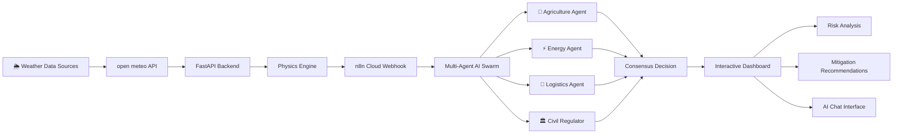
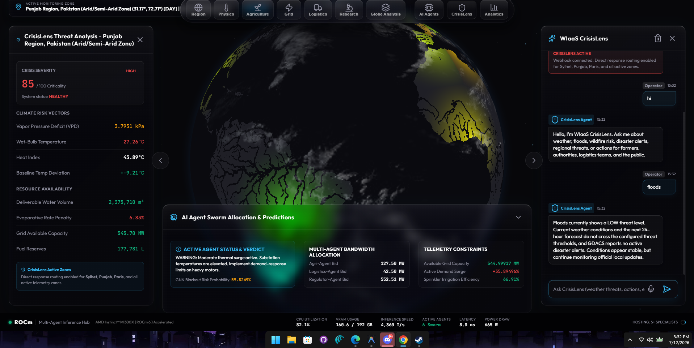
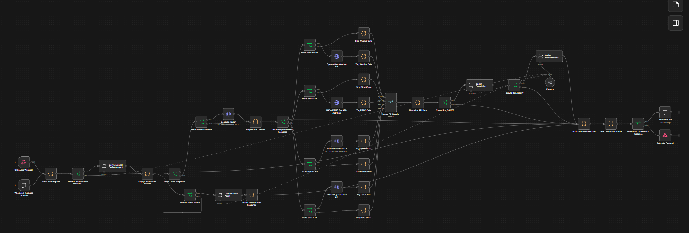

# WIaaS: Weather Intelligence as a Service

## 🌍 About WIaaS

**Weather Intelligence as a Service (WIaaS)** is a next-generation climate intelligence platform that transforms deterministic weather forecasts into explainable, AI-driven mitigation strategies.

Unlike traditional weather dashboards, WIaaS combines **real-time weather data**, **physics-constrained simulation**, **FastAPI**, **n8n workflow automation**, and a **collaborative multi-agent AI swarm** to analyze complex climate events and generate actionable recommendations for governments, emergency responders, utility providers, and agricultural stakeholders.

The platform emphasizes **physics-grounded reasoning**, ensuring that every recommendation is evaluated against real-world environmental constraints rather than relying solely on generative AI predictions.

By integrating simulation, automation, and collaborative AI decision-making, WIaaS delivers transparent, scalable, and intelligent climate-risk management.


## Badges


## 🚀 Quickstart & Installation (Judge / Evaluator Ready)

The entire frontend Single Page Application (SPA) is **pre-compiled and embedded** in `backend/static/`. Anyone evaluating this project **only needs Python 3.10+** — no Node.js or npm installation required to run the full interactive application!

### ⚡ 1-Click Launch

- **Windows:** Double-click [`start.bat`](start.bat) or run:
  ```powershell
  .\start.bat
  ```
- **macOS / Linux:** Run:
  ```bash
  chmod +x start.sh && ./start.sh
  ```

---

### 🛠️ Standard Step-by-Step Installation

1. **Clone the Repository:**
   ```bash
   git clone https://github.com/abdxllxh/WIAAS---Asia.git
   cd WIAAS---Asia
   ```

2. **Install Python Dependencies:**
   ```bash
   pip install -r requirements.txt
   ```

3. **Start the Application:**
   ```bash
   python run.py
   ```

4. **Access the Platform:**
   - 🌐 **Interactive Dashboard & Map:** [http://127.0.0.1:8000](http://127.0.0.1:8000)
   - 📚 **Swagger API Documentation:** [http://127.0.0.1:8000/docs](http://127.0.0.1:8000/docs)
   - 🛡️ **CrisisLens Multi-Hazard Panel:** Integrated in the dashboard

---

### 🧪 Automated Verification Suite

To verify that the atmospheric physics models, multi-hazard classifiers, and self-healing dual-agent responses are operating with 100% accuracy:
```bash
python scripts/verify_crisislens_questions.py
```
*(All 12 specialized intelligence categories execute with automated verification asserting physical units: °C, %, kPa, MW, m³).*

---

### 💻 (Optional) Frontend Development with Hot Reloading

If you wish to modify the frontend source code and use Vite hot-reloading:
```bash
cd frontend
npm install
npm run dev
```
The Vite development server will launch on `http://localhost:5173` with automated API proxying to the FastAPI backend.


##  Key Features

-  **Physics-Constrained Weather Intelligence** powered by deterministic climate forecasts.
-  **Collaborative Multi-Agent AI Swarm** for domain-specific decision making.
-  **FastAPI Backend** providing scalable simulation APIs.
-  **n8n Workflow Automation** for intelligent event orchestration.
-  **Neural-LAM Integration** for physics-grounded weather forecasting.
-  **Interactive Dashboard** for visual climate intelligence.
-  **AI Chat Interface** for explainable climate recommendations.
-  **Multi-Region Simulation Support** across diverse climate baselines.
-  **Physics-Based Verification Engine** to reduce hallucinations and improve reliability.
-  **Designed for AMD Instinct™ MI300X** accelerated computing.


## System Architecture


##  Why WIaaS?

Traditional weather platforms primarily provide forecasts, leaving critical decision-making to human operators.

WIaaS goes beyond forecasting by combining deterministic weather models, physics-constrained reasoning, and a collaborative AI swarm to generate explainable, actionable mitigation strategies.

Instead of asking *"What will happen?"*, WIaaS answers:

- **What is happening?**
- **Why is it happening?**
- **What actions should be taken?**
- **Which sector should respond first?**
- **How should multiple stakeholders coordinate?**

###  Hardware Acceleration: Powered by AMD Instinct™

WIaaS is architected to leverage **AMD Instinct™ MI300X** accelerators through the **ROCm™** open software platform. 

- **Memory-Intensive Swarm Orchestration:** Running parallel specialized cognitive agents alongside real-time physics simulation layers demands massive VRAM capacity. AMD's 192GB HBM3 memory allows full co-location of climate GNNs (Neural-LAM) and LLM swarms on a single node.
- **High-Throughput Ingestion:** Ramping up from our demo to 420+ live simulated economic zones utilizes AMD's massive parallel compute cores to execute matrix operations for diurnal grid and agricultural risk forecasting simultaneously.

This transforms climate intelligence into practical operational decision support.
##  Featured Demo Regions

The following regions demonstrate the flexibility of WIaaS across diverse climate conditions.

| Region | Climate Type | Primary Risk | AI Simulation Focus |
|---------|--------------|--------------|---------------------|
| 🇮🇳 Jaipur, India | Arid Desert | Heatwaves & Water Scarcity | Water allocation and agricultural resilience |
| 🇹🇬 Lomé, Togo | Tropical Coastal | Flooding & Storm Surge | Disaster response and evacuation planning |
| 🇺🇸 Boston, USA | Temperate Coastal | Winter Storms & Urban Flooding | Grid stability and emergency logistics |
| 🌎 Template Region | Configurable | User-defined Scenario | Rapid experimentation and testing |
##  Dashboard Preview

> **Dashboard Screenshot**

The dashboard provides an interactive view of climate intelligence and simulation results.

### Planned Dashboard Features

-  Regional Climate Analytics
-  Live Weather Intelligence
-  Risk Assessment Dashboard
-  Environmental Metrics
-  AI-Generated Recommendations

<p align="center">
  
</p>

---

##  Multi-Agent Chat Interface

> **Multi-Agent AI Swarm**

The AI Swarm enables users to communicate with multiple specialized AI agents that collaboratively generate climate mitigation strategies.

### Planned Interface

-  Interactive AI Conversation
-  Multi-Agent Collaboration
-  Region-Specific Recommendations
-  Explainable Decision Making

<p align="center">
  
</p>

## 📂 Project Directory Structure

```text
WlaaS/
├── backend/                  # FastAPI Application & Simulation Engine
│   ├── app/
│   │   ├── api/v1/           # API endpoints (telemetry, grid, client location, TTS)
│   │   ├── core/             # Configuration, regional climate registries, baselines
│   │   ├── engines/          # Atmospheric physics (Tetens, VPD) & synthetic resource ledger
│   │   ├── schemas/          # Pydantic data validation schemas
│   │   ├── services/         # Open-Meteo telemetry pipeline & GNN-to-LLM bridge
│   │   └── main.py           # FastAPI server entry point with edge-tts neural proxy
│   ├── static/               # Compiled SPA production assets served by FastAPI
│   └── Dockerfile            # Container definition for backend service
│
├── frontend/                 # Vite Single-Page Application (SPA)
│   ├── src/
│   │   ├── asia-map.js       # 60 FPS MapLibre GL Thermographic Asia Map engine
│   │   ├── dynamic-visualizer.js # 1-second dynamic HTML5 canvas telemetry oscilloscope
│   │   ├── chat.js           # Bilingual AI copilot interface & voice speech controls
│   │   ├── ui.js             # Drawer management, navigation state, and tab renderers
│   │   ├── ui-agriculture.js # Agro-climatic diagnostics, action directives, radar chart
│   │   ├── events.js         # Navigation triggers, mobile modules sheet controller
│   │   └── styles/main.css   # Master design system & responsive media queries
│   ├── index.html            # Application HTML shell
│   └── vite.config.js        # Vite production build bundler configuration
│
├── n8n/                      # Multi-Agent Workflow Orchestration
│   └── exports/
│       ├── WIAAS-Asia.json   # Primary WIaaS decision graph (Agri, Grid, Logistics, Research)
│       └── WIaaS-CrisisLens-Asia.json # Emergency multi-hazard crisis response workflow
│
├── docs/                     # Documentation, Reports & Design Artifacts
│   ├── architecture.md       # High-level system architecture specification
│   ├── globe-verification/   # Screenshot test records across Asian metropolises
│   └── reports/              # Field atlas, executive PDF/DOCX reports, and handoffs
│
├── scripts/                  # Automation & Operational Maintenance
│   └── update_n8n_asia_workflows.mjs # Synchronizes and patches n8n workflow decision graphs
│
├── assets/                   # Architecture diagrams & visual identity media
│
├── AGENTS.md                 # Authoritative permanent memory, turn logs & decisions
├── SECURITY.md               # API protection, input sanitization & rate limiting policies
├── SKILLS.md                 # Thermodynamic formulas, GIS standards & developer skills
├── PITCH_DECK.md             # Hackathon pitch deck and value propositions
├── README.md                 # Project overview, setup instructions & directory map
└── docker-compose.yml        # Multi-container local deployment configuration
```

---

## Tech Stack

### Frontend

- React
- Vite
- JavaScript
- HTML5
- CSS3

### Backend

- Python
- FastAPI
- Pydantic
- Uvicorn

### AI & Machine Learning

- Google GraphCast
- Multi-Agent AI
- Reinforcement Learning
- Physics-Constrained Simulation

### Automation

- n8n Cloud Webhooks

### Infrastructure

- Docker
- AMD Instinct™ MI300X
- GitHub


## Roadmap

- [x] FastAPI Backend
- [x] Physics Simulation Engine
- [x] n8n Workflow Integration
- [x] Multi-Agent AI Architecture
- [X] Interactive Dashboard
- [X] AI Chat Interface
- [X] Live Weather Integration
- [X] Explainable AI Decision Traces
- [x] Public Cloud Deployment

## Authors

- **Prince** — Team Lead; Backend Lead & Physics Engine
- **biswadeep_infinity** — Frontend Developer & UI/UX Design
- **vxr** — AI Swarm Architect & Automation
- **Siraj Ahmed** —Technical Documentation & Simulation Scenario Design


## Acknowledgements

Special thanks to the following technologies and communities:

- AMD AI Developer Challenge
- Google GraphCast
- FastAPI
- n8n
- React
- Docker
- Open Source Community


## Support

If you have questions, suggestions, or would like to contribute:

- Open a GitHub Issue
- Submit a Pull Request
- Contact the project team
