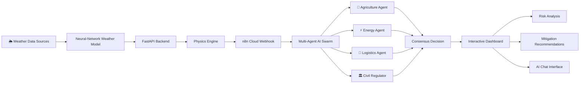

# WIaaS: Weather Intelligence as a Service

## 🌍 About WIaaS

**Weather Intelligence as a Service (WIaaS)** is a next-generation climate intelligence platform that transforms deterministic weather forecasts into explainable, AI-driven mitigation strategies.

Unlike traditional weather dashboards, WIaaS combines **Google GraphCast**, **physics-constrained simulation**, **FastAPI**, **n8n workflow automation**, and a **collaborative multi-agent AI swarm** to analyze complex climate events and generate actionable recommendations for governments, emergency responders, utility providers, and agricultural stakeholders.

The platform emphasizes **physics-grounded reasoning**, ensuring that every recommendation is evaluated against real-world environmental constraints rather than relying solely on generative AI predictions.

By integrating simulation, automation, and collaborative AI decision-making, WIaaS delivers transparent, scalable, and intelligent climate-risk management.

## Badges

## 🚀 Live Demo

> **🚧 Demo Coming Soon**

The production deployment is currently under active development.

Once deployed, this section will include:

- 🌐 Live Application
- 🎥 Demonstration Video
- 📊 Interactive Dashboard
- 🤖 Multi-Agent Chat Interface
- 📄 API Documentation

Stay tuned for the official public release.

## ✨ Key Features

- 🌦️ **Physics-Constrained Weather Intelligence** powered by deterministic climate forecasts.
- 🤖 **Collaborative Multi-Agent AI Swarm** for domain-specific decision making.
- ⚡ **FastAPI Backend** providing scalable simulation APIs.
- 🔄 **n8n Workflow Automation** for intelligent event orchestration.
- 🧠 **Neural-LAM Integration** for physics-grounded weather forecasting.
- 📊 **Interactive Dashboard** for visual climate intelligence.
- 💬 **AI Chat Interface** for explainable climate recommendations.
- 🌍 **Multi-Region Simulation Support** across diverse climate baselines.
- 🔒 **Physics-Based Verification Engine** to reduce hallucinations and improve reliability.
- 🚀 **Designed for AMD Instinct™ MI300X** accelerated computing.

## 🏗️ System Architecture

## 🎯 Why WIaaS?

Traditional weather platforms primarily provide forecasts, leaving critical decision-making to human operators.

WIaaS goes beyond forecasting by combining deterministic weather models, physics-constrained reasoning, and a collaborative AI swarm to generate explainable, actionable mitigation strategies.

Instead of asking *"What will happen?"*, WIaaS answers:

- **What is happening?**
- **Why is it happening?**
- **What actions should be taken?**
- **Which sector should respond first?**
- **How should multiple stakeholders coordinate?**

This transforms climate intelligence into practical operational decision support.
## 🌍 Featured Demo Regions

The following regions demonstrate the flexibility of WIaaS across diverse climate conditions.

| Region | Climate Type | Primary Risk | AI Simulation Focus |
|---------|--------------|--------------|---------------------|
| 🇮🇳 Jaipur, India | Arid Desert | Heatwaves & Water Scarcity | Water allocation and agricultural resilience |
| 🇹🇬 Lomé, Togo | Tropical Coastal | Flooding & Storm Surge | Disaster response and evacuation planning |
| 🇺🇸 Boston, USA | Temperate Coastal | Winter Storms & Urban Flooding | Grid stability and emergency logistics |
| 🌎 Template Region | Configurable | User-defined Scenario | Rapid experimentation and testing |
## 🖥️ Dashboard Preview

> **🚧 Screenshot Coming Soon**

The dashboard provides an interactive view of climate intelligence and simulation results.

### Planned Dashboard Features

- 📊 Regional Climate Analytics
- 🌦️ Live Weather Intelligence
- ⚠️ Risk Assessment Dashboard
- 📈 Environmental Metrics
- 🤖 AI-Generated Recommendations

---

## 🤖 Multi-Agent Chat Interface

> **🚧 Screenshot Coming Soon**

The AI Swarm enables users to communicate with multiple specialized AI agents that collaboratively generate climate mitigation strategies.

### Planned Interface

- 💬 Interactive AI Conversation
- 🤝 Multi-Agent Collaboration
- 🌍 Region-Specific Recommendations
- 📄 Explainable Decision Making

## 🛠️ Tech Stack

### Frontend

- React
- Vite
- JavaScript
- HTML5
- CSS3

### Backend

- Python
- FastAPI
- Pydantic
- Uvicorn

### AI & Machine Learning

- Google GraphCast
- Multi-Agent AI
- Reinforcement Learning
- Physics-Constrained Simulation

### Automation

- n8n Cloud Webhooks

### Infrastructure

- Docker
- AMD Instinct™ MI300X
- GitHub

## 🚀 Roadmap

- [x] FastAPI Backend
- [x] Physics Simulation Engine
- [x] n8n Workflow Integration
- [x] Multi-Agent AI Architecture
- [X] Interactive Dashboard
- [X] AI Chat Interface
- [X] Live Weather Integration
- [X] Explainable AI Decision Traces
- [x] Public Cloud Deployment

## 👥 Authors

- **Prince** — Team Lead; Backend Lead & Physics Engine
- **biswadeep_infinity** — Frontend Developer & UI/UX Design
- **vxr** — AI Swarm Architect & Automation
- **Siraj Ahmed** —Technical Documentation & Simulation Scenario Design

## 🙏 Acknowledgements

Special thanks to the following technologies and communities:

- AMD AI Developer Challenge
- Google GraphCast
- FastAPI
- n8n
- React
- Docker
- Open Source Community

## 💬 Support

If you have questions, suggestions, or would like to contribute:

- Open a GitHub Issue
- Submit a Pull Request
- Contact the project team
